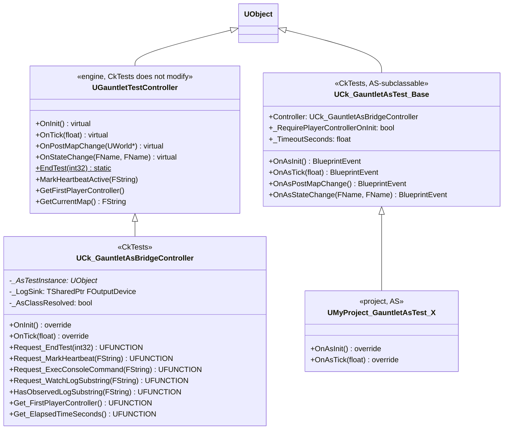
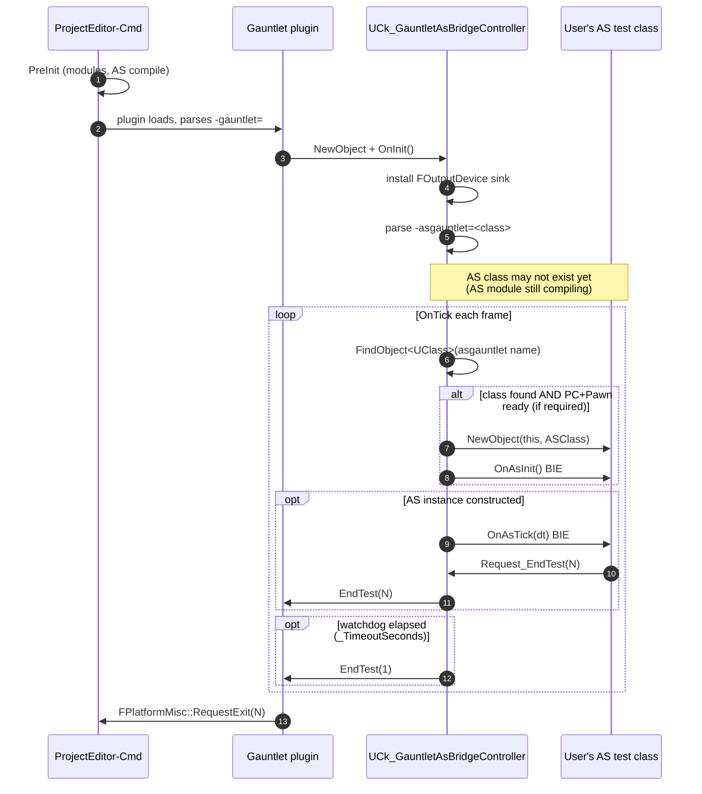
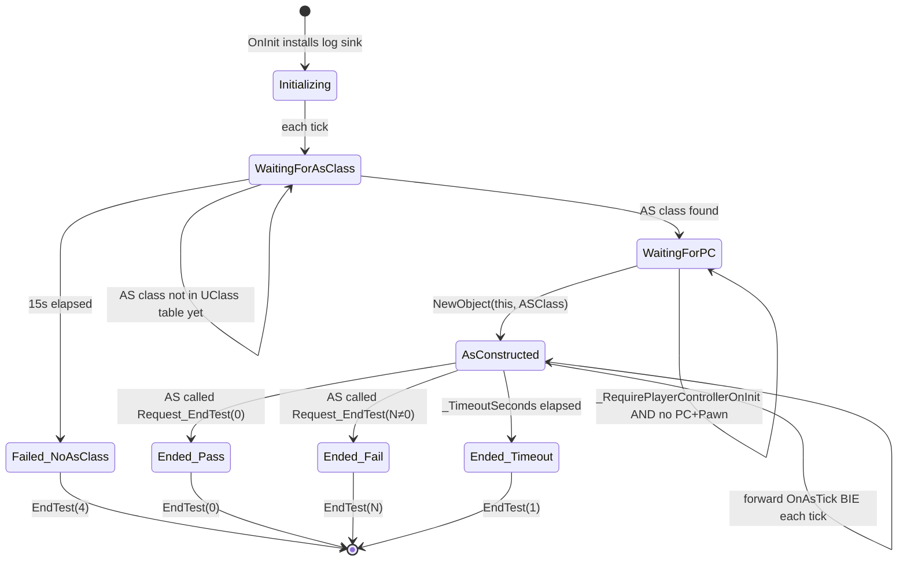
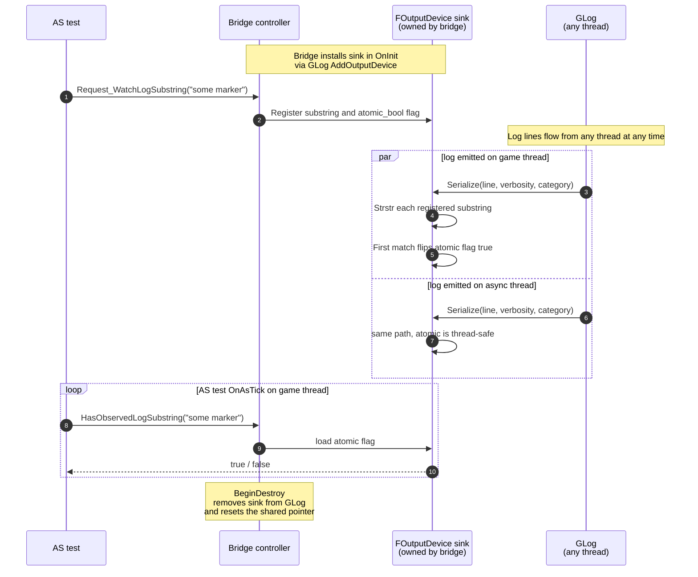
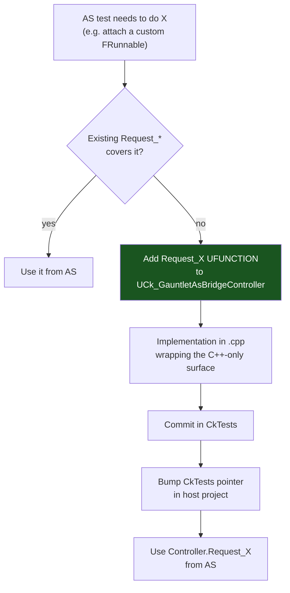
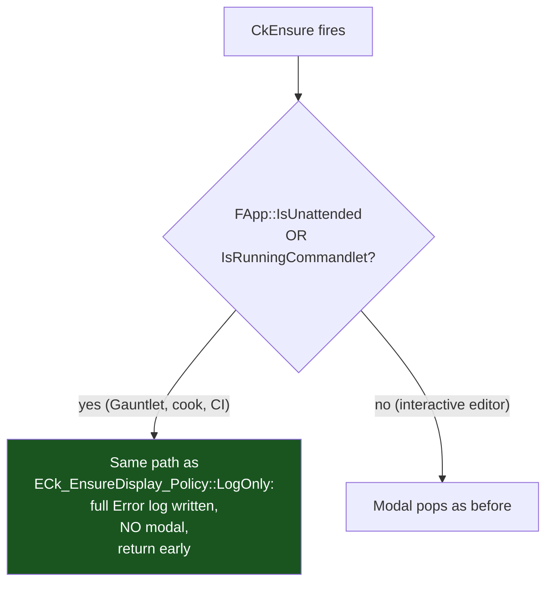

# Gauntlet AS Bridge — Architecture

How `UCk_GauntletAsBridgeController` lets any Ck-based project author Unreal [Gauntlet](https://dev.epicgames.com/documentation/en-us/unreal-engine/gauntlet-automation-framework-in-unreal-engine) tests in AngelScript without per-test C++.

This doc explains the bridge itself — what problem it solves, how it's structured, and how to extend it. For a concrete consumer of the bridge (with example tests, run instructions, and project-specific wiring), see BusterBlock's [`Source/BusterBlock/Tests/Gauntlet/ARCHITECTURE.md`](../../../../../Source/BusterBlock/Tests/Gauntlet/ARCHITECTURE.md) — that doc treats this one as the framework reference.

---

## 1. The problem

`UGauntletTestController`'s C++ API isn't AS-friendly out of the box:

| Method | C++ form | AS-callable? |
|---|---|---|
| `OnInit / OnTick / OnPostMapChange / OnStateChange` | plain `virtual void` | ❌ Not `BlueprintNativeEvent` |
| `EndTest(int32)` | `static` | ❌ Not `UFUNCTION` |
| `MarkHeartbeatActive(FString)` | instance method, `UE_API` | ❌ Not `UFUNCTION` |
| `GetFirstPlayerController / GetCurrentMap / GetCurrentState` etc. | `UE_API` accessors | ❌ Not `UFUNCTION` |

Two ways to bridge this:

1. **Patch the engine** to add `BlueprintNativeEvent` + `UFUNCTION` everywhere needed.
2. **Wrap it externally** with a single bridge controller — same compromise CkTests made for AutoTests vs UE's `FFunctionalTest`.

This module went with (2). The bridge:

- Overrides the C++ virtuals.
- Forwards each to a `BlueprintImplementableEvent` on the AS instance (`OnAsTick → OnAsTick_BIE`).
- Provides `UFUNCTION` wrappers for `EndTest`, `MarkHeartbeatActive`, and friends.

Net result: AS authors write `Controller.Request_EndTest(0)` and the bridge handles the C++ glue. No engine patches required, and adding a new test is a single `.as` file with no editor rebuild.

---

## 2. Class hierarchy

The bridge wraps the C++ Gauntlet API in `UFUNCTION` form so AS can call it. The AS base class declares the lifecycle hooks as `BlueprintEvent` so AS subclasses can override them. AS tests get the bridge as a `UPROPERTY Controller` reference and call `Controller.Request_X(...)`.

---

## 3. Run lifecycle

Invocation shape: `<editor>.exe -gauntlet=Ck_GauntletAsBridgeController -asgauntlet=<AsTestClassName> [-game -unattended -nullrhi ...]`.

Key timing notes:

- AS compile **usually finishes before** the Gauntlet plugin's `OnInit` runs — but not always. That's why the bridge defers `NewObject` of the AS class to the first `OnTick`, not `OnInit`. Spins for up to 15s checking the `UClass` table; bails with **exit code 4** if the class never appears (typically means AS compile failed).
- The `PC+Pawn ready` gate before `OnAsInit` is controlled by `default _RequirePlayerControllerOnInit = true;` on the AS test. Default on; turn off for pre-map tests (e.g. testing config load order).

---

## 4. Bridge state machine

What the bridge is doing each tick:

The watchdog (`_TimeoutSeconds`) is enforced by the bridge before forwarding `OnAsTick`. AS-side internal timeouts (used for richer diagnostics — see the BootSmoke / NpcReachesGoal examples in the BusterBlock companion doc) need a margin under the bridge's `_TimeoutSeconds` so they win the race and get to emit their diagnostic before the bridge fires its generic timeout.

Exit codes:

| Code | Meaning |
|---|---|
| 0 | AS test called `Request_EndTest(0)` — pass |
| 1 | AS test called `Request_EndTest(1)` or bridge watchdog timeout |
| 2 | No `-asgauntlet=<class>` on the command line |
| 3 | `NewObject(this, ASClass)` returned null |
| 4 | AS class name passed in `-asgauntlet=` never appeared in the `UClass` table (AS compile probably failed) |

---

## 5. Log-watching from AS

The hardest C++-only thing to expose was log scanning. AS can't subclass `FOutputDevice` directly, but many headless tests need to react to specific log lines (e.g. waiting for a known marker emitted from AS-side game code).

One sink per bridge instance, shared across all registered substrings. Per-substring `std::atomic<bool>` makes the cross-thread match safe. AS reads the flag on the game thread each tick.

This pattern lets log-driven tests (e.g. "spawn an NPC and watch for `OnGoalReached` from its state machine") be authored entirely in AS — without it, those tests would have required per-test C++ `FOutputDevice` subclasses.

---

## 6. Extending the bridge

If a future AS test needs C++-only surface the bridge doesn't expose, **extend the bridge** — don't write a per-test C++ controller.

Templates for new `Request_*` methods:

- **`Request_ExecConsoleCommand`** — shows wrapping a non-`UFUNCTION` UE API (`PlayerController->ConsoleCommand`) behind a single AS-callable entry point.
- **`Request_WatchLogSubstring`** — shows wrapping a C++-only subclass type (`FOutputDevice`) behind two cooperating UFUNCTIONs (register, then poll).

What you should *not* do: write a per-test C++ `UGauntletTestController` subclass. That fragments the lifecycle handling and forces editor rebuilds per new test — exactly the cost the bridge was built to eliminate.

---

## 7. The `-unattended` modal hang (foundational dependency)

The bridge architecture is only viable because `ck::ensure::Ensure_Impl` in CkFoundation's `CkCore` skips its Slate modal in `-unattended` / commandlet contexts. Without that fix, any ensure firing during early engine init (which happens routinely — AS asset-literal init, plugin startup, etc.) would call `FSlateApplication::AddModalWindow → FWindowsPlatformProcess::Sleep` with no UI to dismiss the dialog, blocking the main thread indefinitely.

Severity stays Error (matches stock UE's `core.EnsuresAreErrors` CVar default), so cooks still see the bugs — the fix only suppresses the modal, not the diagnostic.

**Implication for bridge maintainers:** don't add code paths that pop modals during early engine init. If you add a `Request_X` that surfaces an engine API with modal-popping potential, gate the modal on `!FApp::IsUnattended() && !IsRunningCommandlet()`.

Lives at `Plugins/CkFoundation/Source/CkCore/Public/CkCore/Ensure/CkEnsure.cpp`. See CkFoundation commit `0eb3208aa fix(CkCore/Ensure): treat -unattended / commandlet as LogOnly`.

---

## 8. Quick reference

| Question | Look at |
|---|---|
| Bridge C++ impl | `Source/CkTests/Public/CkGauntletAsTest_Base.h` + `Private/CkGauntletAsBridgeController.cpp` |
| AS base class | Same header — `UCk_GauntletAsTest_Base` |
| Module dep on Gauntlet | `Source/CkTests/CkTests.Build.cs` (`PrivateDependencyModuleNames` includes `Gauntlet`) |
| Plugin dep on Gauntlet | `CkTests.uplugin` `Plugins` array |
| Why `-unattended` works | `Plugins/CkFoundation/Source/CkCore/Public/CkCore/Ensure/CkEnsure.cpp` (the `IsUnattended || IsRunningCommandlet` short-circuit on the LogOnly path) |
| Concrete project using the bridge | BusterBlock — see `Source/BusterBlock/Tests/Gauntlet/ARCHITECTURE.md` for example tests + run instructions |

---

## See also

- **BusterBlock's companion doc**: `Source/BusterBlock/Tests/Gauntlet/ARCHITECTURE.md` — concrete consumer with example tests and the BootSmoke / NpcReachesGoal patterns.
- **AutoTest precedent in CkTests**: `Source/CkTests/Private/CkAutoTestRunner.cpp` — same architectural shape (C++ runner forwards lifecycle to AS test body). Worth reading if you're new to the bridge pattern.
- **Stock UE Gauntlet docs**: <https://dev.epicgames.com/documentation/en-us/unreal-engine/gauntlet-automation-framework-in-unreal-engine>
